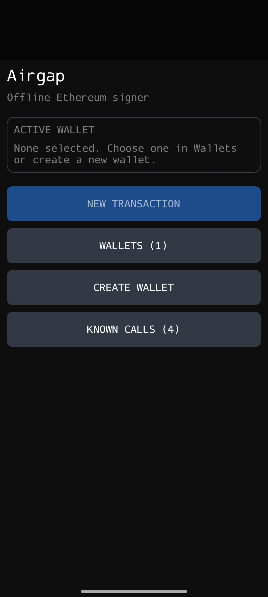
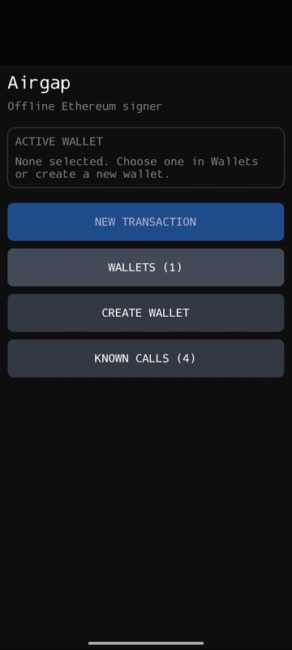
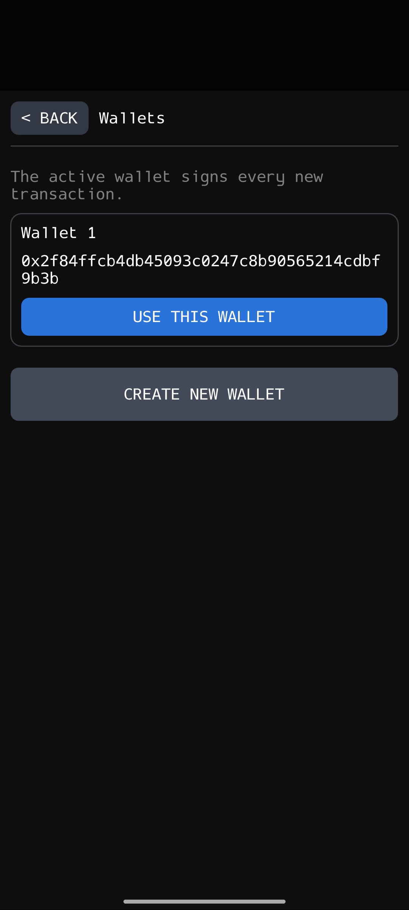
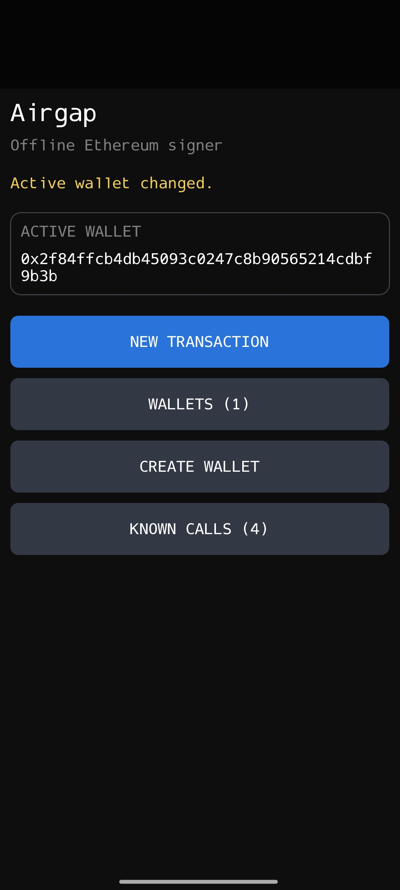
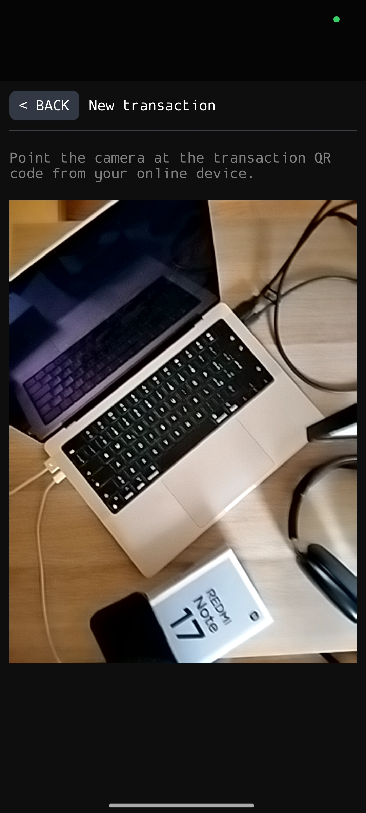
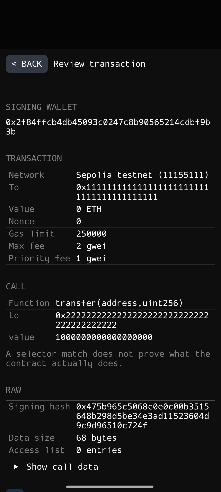
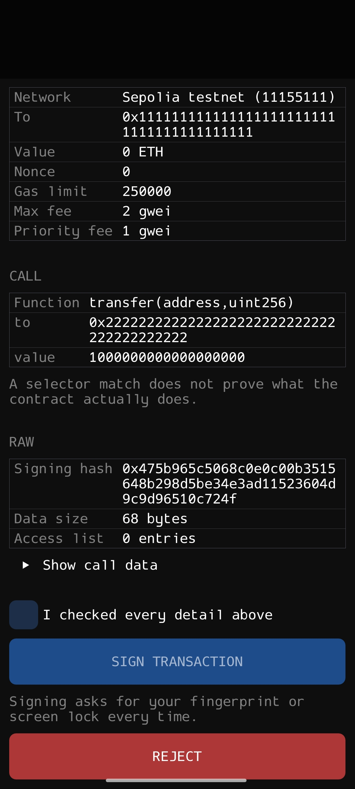
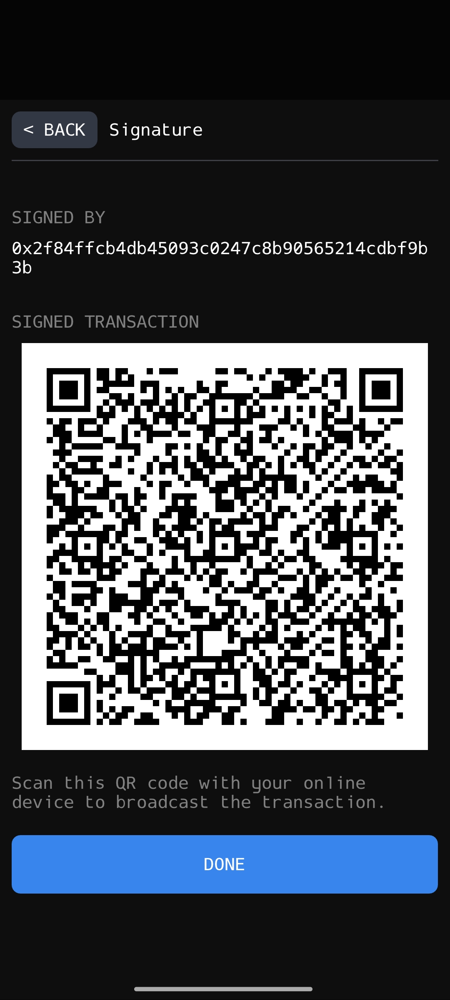
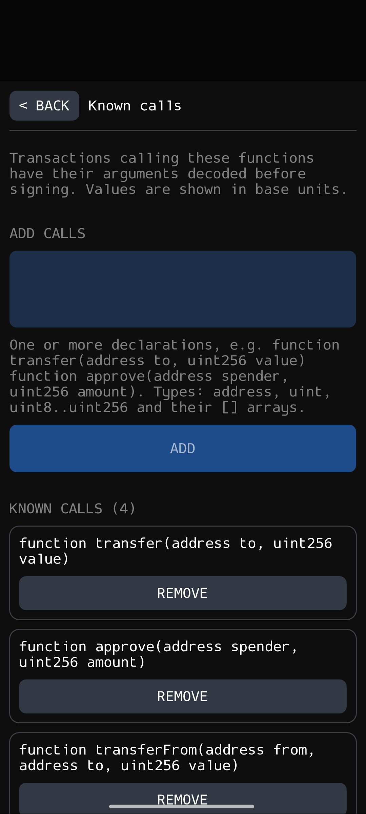

# android-air-gapped-cold-wallet

> Your crypto wallet is just a **32 bytes sequence** stored somewhere on your disk, to keep it save, keep it on a device where the only communication channel with the external word is a camera.

I bought a brand new [Redmi Note 17](https://www.mi.com/global/product/redmi-note-17/specs/) and turn it into my Ethereum cold wallet that signs transactions and never touches the internet.

> [!WARNING]
> I made this for me and it is not audited nor it has long-term support, 
> so if you lose money, shame on you. With the right precautions your should be safe, 
> but never trust stranger's code on the internet that touches your crypto! Also 
> keep in mind that even if I made it for a Redmi Note 17, it should run on most 
> Android phones, not just mine.

<table>
  <tr>
    <td></td>
    <td></td>
  </tr>
  <tr>
    <td align="center">Home</td>
    <td align="center">Scan, check, sign. That's it</td>
  </tr>
</table>

Disable every wireless communication channel on the phone, no Wi-Fi, Bluetooth, SIM or NFC, everything is turned off running [disable-connectivity.sh](disable-connectivity.sh). There are two type of keys, (1) your actual evm wallet private key and (2) an envelope key that encrypts the first one. The first one is generated randomly while the other is created inside an [hardware backed L1 TEE](https://source.android.com/docs/security/features/trusty), which wraps the wallet key that gets written encrypted on disk and decrypted only during the signing process. An online device needs to
be used to build transactions and broadcast them once they are signed in the phone. The only way
data moves between the two is with **QR codes**; the online device shows a QR code and the phone scans it, the phone sign and generated another QR code and the online device scans it. The only way
in-and-out is through the camera.

---

## TL;DR
- [Wallet creation & 2 key design](#wallet-creation)
- [Storing keys on disk safely](#how-keys-are-stored-on-disk)

---

## Wallet creation

> Android L1 TEE can create keys that live in a dedicate part of the hardware and can never be
> leaked or extracted by design, however there is no support for ECDSA curve keys, the type we
> need for an ethereum wallet, so we engineer around that with a standard 2 key design.

Tap **CREATE WALLET** and the phone makes a new private key using its own random number generator. Then it locks the key inside the Android Keystore, which is backed by the phone's secure hardware. You get 24 words mnemonic, showed once and discarded forever after you confirm it, you want to back
it up in case the device is compromised, broken, lost or whatever. You can make as many wallets as
you want and select the active one.

> [!IMPORTANT]
> Write the mnemonic on paper if you want to save them, and **not** on another device, otherwise the
> whole point of a cold wallet is gone, because it would be like duplicating the key on an hot
> device. I would advise you to even considering using this app if you didn't figure this
> out yourself. 


<table>
  <tr>
    <td></td>
    <td></td>
  </tr>
  <tr>
    <td align="center">Pick a wallet</td>
    <td align="center">Now it's the one that signs</td>
  </tr>
</table>

## How keys are stored on disk

> Wallet keys never touche the disk in plain text, what gets written is a like a locked box
> containing multiple sealed envelopes, and the only thing that can open those envelopes lives
> inside a part of the hardware that is unbreakable by design, with the only thing that can
> open it being either your fingerprint or lock-screen code.

Every wallet lives in one small binary file, `wallets.bin`, inside the app's private storage,
instead of using JSON, SQL, or any other format, we just use bytes with a custom defined data
layout:

```
wallets.bin

offset  0      1         2             6             10
        +------+---------+-------------+-------------+
header  | 0xAA | version |  key count  |  file size  |
        | 1 B  |   1 B   |   4 B, LE   |   4 B, LE   |
        +------+---------+-------------+-------------+

then one entry per wallet, back to back:

offset  0      1      2         14             46      62         82
        +------+------+---------+--------------+-------+----------+--------+
entry   | name | key  |  nonce  |  ciphertext  |  tag  | address  |  name  |
        | len  | ver  |         |  wallet key  |       |          |        |
        | 1 B  | 1 B  |   12 B  |     32 B     |  16 B |   20 B   | len B  |
        +------+------+---------+--------------+-------+----------+--------+
                      \_____ encrypted key, 60 B ______/
```

In code this data structure is a key entry ([wallet_store.hpp](native/wallet_store.hpp)):

```cpp
struct StoredKey {
    std::string name;
    uint8_t keyVersion = 2;

    std::array<uint8_t, 60> encryptedKey{};
    eth::Address address{};
};
```

The first time you save a wallet, the app asks the Android Keystore for an AES-256 key called `airgap.wallet-store.v2`, that gets generated inside the TEE and never leaves it, the app only gets a handle to it, and it's created with these rules ([wallet_store.cpp](native/wallet_store.cpp)):

```cpp
setUserAuthenticationRequired(true)
setUserAuthenticationParameters(0, kAuthBiometricStrong | kAuthDeviceCredential)
```

The `0` is the timeout, meaning that every single use will ask for your fingerprint, there is no warm time-window or grace period. This feature is supported starting from Android 12.

The key-related communication between the app and the disk logically works like this:

- _wrapping_ (create wallet): the 32 byte wallet key goes into the TEE, you touch the sensor and
the TEE hands back a (1) random nonce, (2) the ciphertext and (3) a tag; the original _32 bytes_
of the wallet private key become _60 bytes_, after that we make sure to wipe the plain unencrypted
private key from memory.

- _unwrapping_ (sign): you touch the sensor, the TEE decrypts the 60 bytes back into the key, the app rebuilds the wallet and checks its address matches the stored one, then signs, then wipes the key again; it does this on every transaction so the private keys stays unencrypted in memory for the
lowest time possible.

## How to sign transaction

> To use a cold wallet you need an external device connected to the internet that can broadcast
> the transaction to the network; it's the messenger, it knows nothing about your key and never
> sees it or touch the cold wallet hardware, it just shows the cold device what needs to be signed
> and broadcast back what the device shows it.

**(1)** On your online device you build an _unsigned EIP-1559 transaction_ and encode it as as QR code,
it can be raw hex (`0x02...`) or raw bytes. **(2)** On the phone you tap **NEW TRANSACTION**
and point the camera at the QR code. **(3)** The phone decodes everything and shows to you all the details you can verify in a (semi)human-readable form; things such as the network, receiver,
amount, gas, nonce and so on. If the transaction calls a function [it knows](#known-calls),
like an ERC-20 `transfer`, it shows the arguments too.

<table>
  <tr>
    <td></td>
    <td></td>
  </tr>
  <tr>
    <td align="center">Scan</td>
    <td align="center">Read what you're actually signing</td>
  </tr>
</table>

**(4)** After checking (carefully!), you can tick the box and tap **SIGN TRANSACTION**.
**(5)** The phone asks for your fingerprint and **(6)** the signed transaction appears as a QR
code, and at this point you can scan it with your online device and broadcast it.

<table>
  <tr>
    <td></td>
    <td></td>
  </tr>
  <tr>
    <td align="center">Sign or reject</td>
    <td align="center">Signed. Scan it back and broadcast</td>
  </tr>
</table>

## Known calls

> Transactions are raw bytes, there is no text that is readable by human in them. If you want to
> understand what you are signing you need to **know how to parse** each single transaction, that
> means that you can't universally decode every transaction deterministically and interpret it.

We store a default list of function declarations the app uses to decode transaction bytes into
know type of transactions. By default we add `transfer`, `approve`, `transferFrom` and a Uniswap-style swap, but is easy to add others in human readable and writable form:

```
function transfer(address to, uint256 value)
```

> [!NOTE]  
> You can always scan transactions with another online capable device and scan them properly
> with already existing tools, which does not compromise security in any way since you are
> scanning unsigned data, and unsigned data won't be valid on chain.

<p align="center">
  
</p>

## On other phones compatibility 

What works on this Redmi Note 17 most likely works on any modern Android device, the required
specs are:

- Android 12 or newer with a 64-bit ARM chip (`arm64-v8a`).
- A camera (of course).

If you do this I strongly suggest you to either do a proper factory reset on the phone or, even
better, buy a new one and never connect it to the internet once.

## Building & Setting up a phone

> [!NOTE]
> Some pieces of the toolchain, like `setup-ndk.sh`, have hardcoded paths that assume the
> script is running on a Mac, for example: `~/Library/Android/sdk`, so make sure to audit
> the entire building toolchain if you run on Linux.

The entire toolchain is custom made for this project. At minimum you need Android SDK,
NDK version `27.1.12297006`, build-tools `36.0.0`, CMake, Ninja, [vcpkg](https://vcpkg.io) and also a JDK. This two commands build the entire app:

```sh
source native/setup-ndk.sh
./app/build.sh
```

The app APK is pushed on your device at `/sdcard/`, go there from the file manager, tap the APK and install it. You can also run `./dev.sh` for hot reloading if you want to make modifications; it rebuilds on every change on source files, push and opens the installer on the phone automatically.

## Attributions

The entire suite of low-level C code in `native/crypto` that implements key EVM primitives from
scratch, is taken directly from another project of mine: [paoloanzn/evmxt](https://github.com/paoloanzn/evmxt). The code for the [camera control](./native/camera.hpp) was partially taken from [this blog](https://sisik.eu/blog/android/ndk/camera). The majority of
this codebase was developed with AI with _human_ supervision and directions, if that's a concern
to you i would re-think your meter of judgment for software ❤️.

---

## Author

Research project from Paolo Anzani 🪖 [@paoloanzn](https://x.com/paoloanzn)